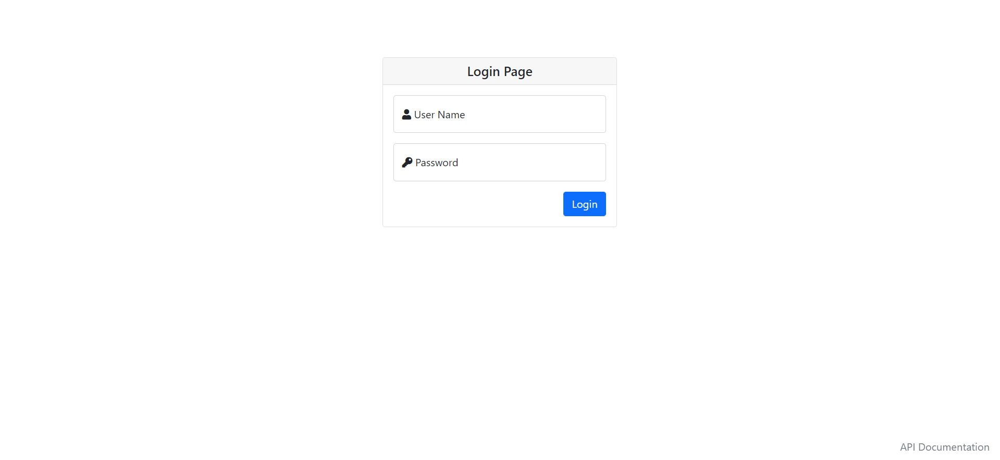
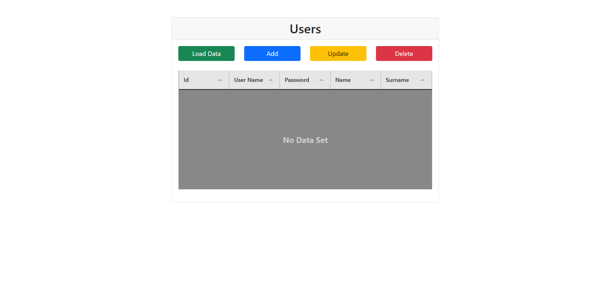
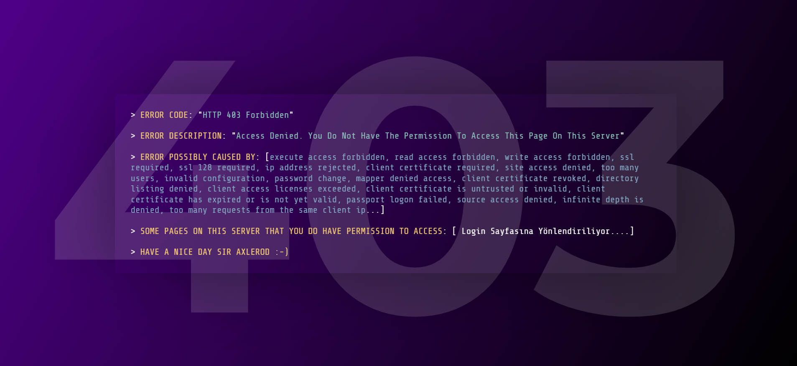

# Çalışmayı Local'e Çekmek için,

Git CLI : `git clone https://github.com/hsyndlgc5334/OnCalisma.git`

# Gereksinimler,

1. MS SQL 'de User tablosu oluşturulmalı ve 1 tane kayıt atılmalı.
2. Api/appsettings.json' a ConnectionString yazılmalı.

3. https://localhost:5001/login.html login sayfasına gidip giriş yapılmalı.

# User Interfaces

